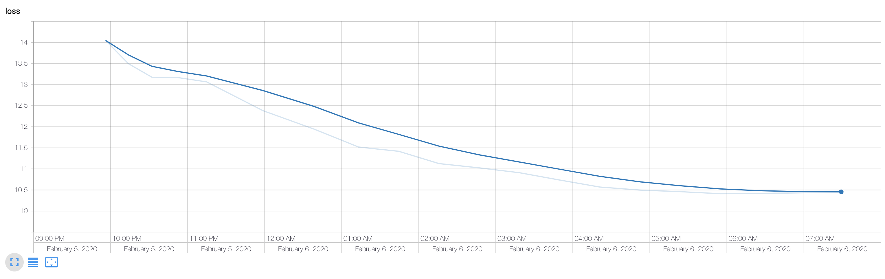

# RoboNet-哨岗相机机器人视觉定位算法

```
RoboNet/
├── yolo_test_with_camera.py             #哨岗相机定位测试
├── yolo_tiny.py                         #YOLO v3 tiny类函数
├── Car_info.py                          #战车尺寸参数定义
├── coordinate_transformer.py            #相机模型定义，用于坐标变换
├── Tracker.py                           #战车位姿卡尔曼跟踪器
├── README.md                            #说明文档
├── test_video.mp4                       #测试视频
├── font                                 #展示检测结果时用的字体文件
│   └── FiraMono-Medium.otf              #字体库
├── model_data                           #神经网络模型权重及配置文件
│   ├── AngleEstimator.h5                #朝向角估计模型文件
│   ├── RedBlueDetect.h5                 #红蓝车YOLO模型文件
│   ├── robomaster_classes.txt           #红蓝车YOLO模型索引对应类别
│   ├── ROIFeature.h5                    #车轮、装甲板、尾灯检测模型文件
│   ├── roi_classes.txt                  #车轮、装甲板、尾灯检测模型索引对应类别
│   ├── yolo_anchors_robot.txt           #红蓝车YOLO模型anchors
│   └── yolo_anchors_roi.txt             #车轮、装甲板、尾灯检测模型anchors
├── pics                                 #README中插入图片文件
│   ├── loss_for_angle_estimation.png    #训练朝向角估计模型时损失函数图
│   ├── loss_for_rb_car_detection.png    #训练红蓝车检测模型时损失函数图
│   ├── keypoints.jpg                    #关键点位置和顺序图
│   ├── select_4_keypoints.jpg           #选取关键点示例
│   ├── software-framework.png           #软件框架图
│   ├── test_result.gif                  #测试效果动态图
│   └──Yolo_v3_Structure.png             #YOLO v3模型结构图
├── yolo3                                #YOLO v3模型
│   ├── model.py                         #YOLO v3模型
│   └── utils.py                         #辅助函数
```


## 依赖工具

该部分基于Python语言，利用深度学习算法、视角变换和跟踪算法实现战车的定位和跟踪；

可通过rospy实现与战车间的通讯；

程序依赖工具如下：

* python3.7
* TensorFlow==1.15
* numpy
* opencv
* sklearn
* matplotlib
* filterpy


## 内容简述

本程序可利用全局视角相机采集的图像信息，基于神经网络图像识别技术对机器人特征进行识别，并可求解对应机器人的全局位置与姿态。该位姿信息可以通过通讯传送给己方机器人，从而提高己方定位精度，并为智能决策提供全局态势判断。本程序主要包含以下五个功能模块：

- 红色车、蓝色车物体检测模块（YOLO v3）

- 车轮、装甲板、尾灯检测模块（YOLO v3）

- 估算战车在ROI坐标中的朝向角模块（卷积+全连接预测角度的sin与cos值）

- 像素图与地图之间坐标变换模块

- 基于卡尔曼滤波与匈牙利算法的车辆位置与角度跟踪模块

  

  软件架构如下图所示

  

  


各模块简要介绍如下（本算法理论基础及感知部分算法介绍可见项目wiki）：

### 红色车、蓝色车物体检测模块（YOLO v3）

* 采用YOLO v3的Tiny版本，输入为416x416的RGB图，输出BoundingBox的位置、尺寸、置信度及类别概率

* loss图：

* 网络结构图（把Darknet53换成19， 两个多尺度预测）：

  

### 车轮、装甲板、尾灯检测模块

* 与红蓝车检测模型基本相同，只是输入尺寸改为288x288，输出类别有：车轮、红1装甲板、红2装甲板、蓝1装甲板、蓝2装甲板、红尾灯、蓝尾灯
* 将车检测与车的特征检测分开的原因：
  * 在输出尺寸416x416的情况下，直接检测所有特征可能分辨率不够
  * 类别变多会使网络运行速度变慢(影响不大)
  * 使得车的特征定位更精确，有利于之后估计车在世界坐标下的位置

### 根据ROI估算战车在ROI坐标中的朝向角

* 尝试过基于颜色、边界特征估算车的朝向角，人工寻找特征较为麻烦，且效果不够理想，所以最终采用神经网络预测

* 输入96x96x1的灰度图

* 输出该图对应朝向角的cos，sin值（没有直接预测角度，因为0度和360度实际朝向一样，这会给损失的计算带来麻烦）

  * 朝向正右方时角度为0（cos=1，sin=0）
  * 朝向正下时角度为90（cos=0，sin=1）

* 之后可以根据尺寸缩放调整cos，sin值，获得原始尺寸下的朝向角

* loss

  

### 像素图与地图之间坐标变换

* 首先通过张正有标定法，标定了所用哨岗相机，得到了哨岗相机内参
* 之后在实际应用中，选择地图与像素图大于等于4个点对，计算出地图到像素图的单应性矩阵，已知内参矩阵通过SolvePnP得到相机的外参
* 可实现已知某特征像素点坐标及该特征在世界坐标的高度，反解出该特征在世界坐标系下的坐标

### 基于卡尔曼滤波与匈牙利算法的车辆位置与角度跟踪

* 在得到检测结果后，可得到每个检测到的bounding box属于ID（红1、红2、蓝1、蓝2）的概率矩阵，再计算坐标变换后的车位置与卡尔曼滤波预测位置的IOU矩阵
* 将上述两个矩阵相加，通过匈牙利算法选出每个检测结果对应的ID，进而更新卡尔曼滤波器


## 软件效果展示

### 测试步骤

* 在RoboNet目录下，运行`python yolo_test_with_camera.py`

* 在弹出的scene_image窗口中依次双击选择4个关键点（按退格键清除上一次选中点，4个点选中好后按回车确认）
  

  关键点的选择顺序为：
  


### 测试结果


## 开源协议

MIT License